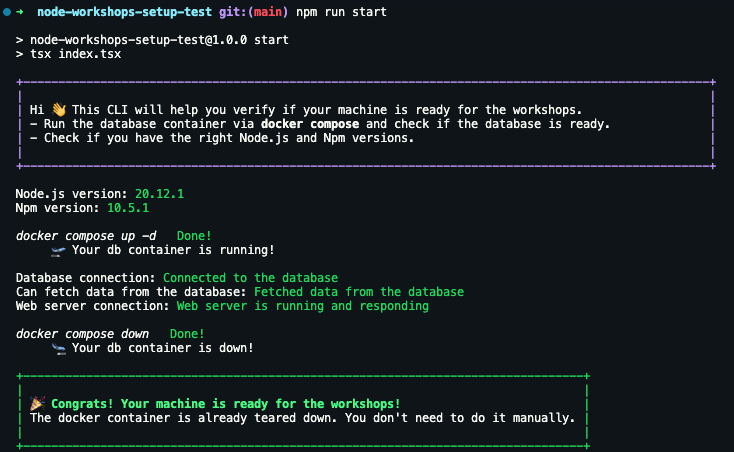

# Node.js workshops setup test

If you're reading this, you're probably preparing for Node.js workshops with me.

(More about me - 🧑‍💻 [michalczukm.xyz](https://michalczukm.xyz))

Great! Now, let's do some preparations 🎉

> [!WARNING]  
> Please do the below setup check **before workshops** to make sure you have your environment ready.
> In will save us time on firefighting with environment setup at the beginning of our workshops 🙇

## Prepare your machine

You'll gonna need **one of currently supported LTS versions** of

- `node.js` (it should be written on main page of [nodejs.org](https://nodejs.org/en/)), at least 20.x
- `npm` (if you have `node.js` LTS, you also should have up to date `npm` version)
- `docker` with `docker compose`, [docker.com](https://www.docker.com/)

If not specified otherwise in preparation docs you should receive before workshops.

### [Optional] Node version manager

Just for convenience, I recommend you to use `nvm` for this, but below you have all options:

- Node.js
  - (❇️ recommended) [nvm - Node Version Manager for UNIX systems](https://github.com/nvm-sh/nvm)
  - [nvm-windows - Node Version Manager for Windows](https://github.com/coreybutler/nvm-windows)
  - [Install globally build from Node.js](https://nodejs.org/en/)
- npm
  - Should be already installed with Node.js (no matter how you installed Node.js)

## Check your environment

Steps

1. Clone this repo on your local machine
1. Install dependencies with `npm ci`
1. Run `npm start`

You should see output similar to the one below (with info about `node.js` setup being legit 🤞).

> [!TIP]  
> If there are any issues, please let me know and we will sort it out together.
> This verification is pretty verbose, please take a look at the errors, they should give you a hint what's wrong.
>
> The DB container maps to `5123` port - check if it's available, or change the port in `.env` file.
